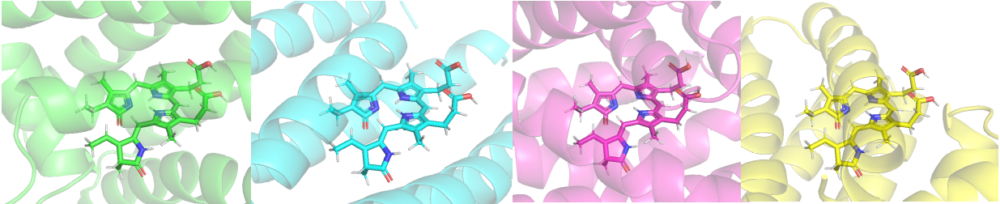
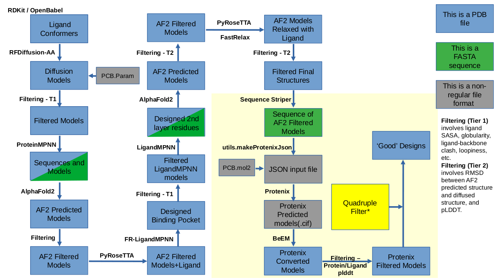
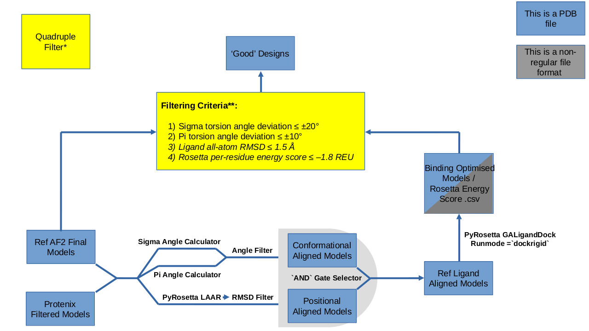

# PCB_Binder_Diffusion

**De Novo Design of Phycocyanobilin Binding Proteins Towards Rational Control of Ligand Conformation**

---

## Overview

This repository contains the computational pipeline developed as part of Wenhan Hu’s MRes Systems and Synthetic Biology project at Imperial College London (2025).  
Computational methods were adapted from [heme_binder_diffusion](https://github.com/ikalvet/heme_binder_diffusion) and related open-source frameworks.

The key feature of this pipeline, compared with the original script, is that the output binders preserve the **exact ligand conformation** specified as input.  
This means you can design multiple valid protein binders in different sequence and structural contexts, but all will lock the ligand in the conformation you choose.

---

## Pipeline

The idea of the general pipeline is illustrated below:

The additional filtering based on ligand conformation I made is highlighted here:

---

## Future Work

1. This approach should also work on other flexible ligands. You only need to provide their conformers as `.pdb` files and the corresponding `.params` file.  
2. The validation module (Protenix with GALigandDock) can be replaced with better tool. I am replacing it with **Boltz-2** (https://boltz.bio/boltz2) and will recalibrate filtering conditions using `positive_control_boltz2.ipynb`.

---

## Citation

If you use this pipeline or adapt it, please cite:

Hu, W. (2025). *De Novo Design of Phycocyanobilin Binding Proteins Towards Rational Control of Ligand Conformation*. Imperial College London, MRes Systems and Synthetic Biology.
